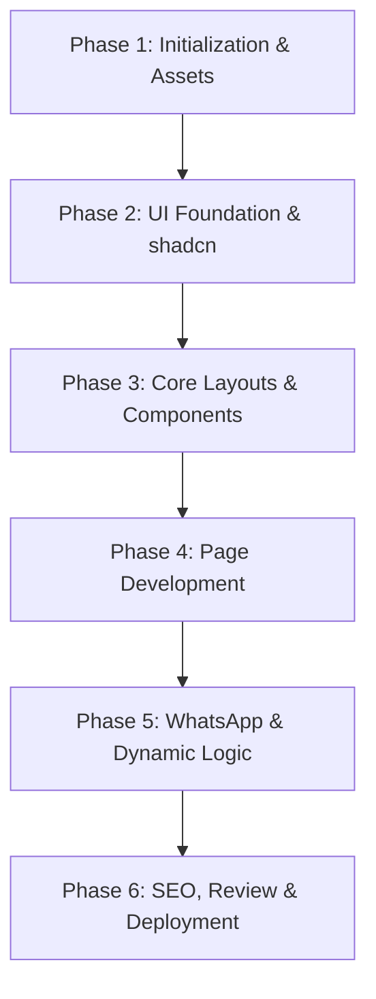

# Development Phases & Page Blueprint: Ali Cool Point (SMC-Private) Limited

This document outlines the step-by-step development phases and detailed component design for each page of the website.

---

## 📅 Part 1: Development Phases (Roadmap)

To build a premium, error-free website, we will execute the development in **6 distinct phases**:



### 🔨 Phase 1: Initialization & Asset Organization
*   **Next.js Init**: Create the Next.js app in the `./ali-cool-point-smc` directory using:
    ```bash
    npx create-next-app@latest . --ts --tailwind --eslint --app --src-dir=false --import-alias="@/*"
    ```
*   **Asset Copying**: 
    *   Create `/public/images`, `/public/videos`, and `/public/documents` directories.
    *   Move `main logo .jpeg` $\rightarrow$ `/public/images/logo.jpg`
    *   Move `owner pic .jpeg` $\rightarrow$ `/public/images/ceo.jpg`
    *   Move the company profile slides and client logos into `/public/images/slides/` and `/public/images/clients/`.
    *   Move `WhatsApp Video 2026-07-16 at 11.22.51 AM.mp4` $\rightarrow$ `/public/videos/intro.mp4`.
    *   Move certificate PDFs $\rightarrow$ `/public/documents/`.

### 🎨 Phase 2: Design System & shadcn/ui Foundation
*   **Colors Setup**: Configure `tailwind.config.ts` to include the metallic blue gradient colors, Slate-900 base, and glassmorphic utilities.
*   **Fonts**: Integrate Google Fonts (`Outfit` for headings, `Inter` for body text) via Next.js `next/font/google`.
*   **shadcn/ui Installation**: Initialize shadcn/ui and download required UI primitives:
    *   `button`, `card`, `dialog` (for certificate viewer & product modals), `table` (for pricing matrix), `carousel` (for client logos), `sheet` (for responsive mobile navigation), and `toast` (for form submissions).

### 📐 Phase 3: Core Layouts & Shared Components
*   **Header (Navbar)**: Sticky, glassmorphic header with logo, navigation links (Home, About, Services, Deals, Contact), and a CTA button *"Emergency Repair (WhatsApp)"*.
*   **Footer**: Quick links, official business registrations, contact info, and copyright section.
*   **Custom Video Player**: A custom React player wrapper for `intro.mp4` with a glassmorphic play button, volume toggle, and progress bar, styled inside a premium dashboard-style frame.
*   **WhatsApp API Linker**: Helper utility to generate pre-filled WhatsApp click-to-chat links:
    *   `https://wa.me/923004599911?text=Hi%20Ali%20Cool%20Point...`

### 🖥️ Phase 4: Page Content Development
*   **Home Page (`page.tsx`)**: Hero banner, video embed, quick services grid, e-commerce summary, trust badge grid, and client carousel.
*   **About Page (`about/page.tsx`)**: CEO portrait and message, vision/mission cards, core values layout, and "Why Choose Us" timeline.
*   **Services Page (`services/page.tsx`)**: Service lists with interactive pricing/tariff filters for AC installation & parts.
*   **Deals Page (`deals/page.tsx`)**: Product listing grid with category filtering and interactive specification sheets.
*   **Certifications Page (`certifications/page.tsx`)**: High-trust document gallery with overlay modal lightboxes.
*   **Contact Page (`contact/page.tsx`)**: Form, physical contact cards, and Google Map.

### 🔗 Phase 5: Interactivity & WhatsApp Ordering Logic
*   **AC Ordering System**: Hook up product cards on the `/deals` page. Clicking "Order via WhatsApp" launches WhatsApp Web or app with a template:
    *   *“Hello Ali Cool Point, I would like to order the Pearl [AC Model] ([Capacity] Ton) priced at PKR [Price]. Please let me know the delivery schedule.”*
*   **Service Request Form**: Connect the contact/quote form to validate fields using Zod and trigger a formatted WhatsApp message or simulated email dispatch.

### 🚀 Phase 6: Performance, SEO & Deployment
*   **SEO Optimization**: Add semantic titles, descriptions, open graph cards, and canonical links.
*   **Responsive Review**: Rigorously test layouts on Mobile, Tablet, and Desktop screens.
*   **Build Optimization**: Run `npm run build` to generate static pages and optimize image loading.
*   **Vercel Deployment**: Push to production.

---

## 📱 Part 2: Page Layout Blueprint & Component Designs

### 1. Home Page (`/`)
*   **Section 1: Hero Header (Vibe: Premium & Technical)**
    *   *Layout*: Two-column grid (Desktop) / Single column stack (Mobile).
    *   *Left*: Title: *"AC Installation, Repair & Commercial Engineering Specialists"* with a glowing gradient. Sub-bullet points of official partnerships (e.g., Authorized Pearl AC Dealer).
    *   *Right*: Custom Video Frame displaying the autoplaying, loop-muted intro video (`intro.mp4`). Hovering reveals a "Play Sound" button.
*   **Section 2: "We Are Certified" Trust Badges (Vibe: Corporate & Aligned)**
    *   *Details*: Horizontal grid showing 7 logos (SECP, FBR, KCCI, PEC, SESSI, SRB, IPO).
    *   *Style*: Grayscale badges with a subtle metallic outline. On hover, they rotate slightly and colorize to their brand colors with a glow effect.
*   **Section 3: Core Services Grid**
    *   *Details*: 3 prominent interactive cards: 1. AC Service & Installation, 2. Commercial Renovation, 3. Home Appliance Repair.
*   **Section 4: Featured AC Deals**
    *   *Details*: Showcase of 3 best-selling Pearl AC units with specs (Inverter, Eco-friendly, Ton sizes) and a CTA button.
*   **Section 5: Client Logo Carousel**
    *   *Details*: Rolling infinite scroll showing Virtual University, Meezan Bank, TCS, and Foodpanda logos.

### 2. About Us Page (`/about`)
*   **Section 1: CEO Statement**
    *   *Left*: Portrait of CEO Hasnain Ali (`ceo.jpg`) in a slate-gray card with a brushed metallic cyan outline.
    *   *Right*: CEO Message text emphasizing trust, certified status, and client satisfaction.
*   **Section 2: Vision & Mission**
    *   *Layout*: Two-column grid of glassmorphic cards.
    *   *Content*: Company Vision and Company Mission texts.
*   **Section 3: Core Values & Why Choose Us**
    *   *Layout*: Interactive accordion or grid showing 5 values (Quality, Integrity, Commitment, Reliability, Responsibility).

### 3. Services Page (`/services`)
*   **Section 1: Service Catalog**
    *   Tabbed interface switching between: **HVAC/AC Services**, **Commercial Renovation & Paint**, and **Wood & False Ceiling**.
*   **Section 2: Tariff Pricing Calculator (Interactive)**
    *   *Details*: Full searchable and filterable datatable of charges from `Pearl Customer Service.docx`.
    *   *Feature*: Customer can select "Wall Mounted" or "Floor Standing", select capacity (1 Ton to 8 Ton), choose if they need brackets or extra piping, and the table highlights the exact authorized rate instantly. This builds 100% transparency.

### 4. Deals / Products Page (`/deals`)
*   *Layout*: Filter sidebar (Filter by Ton size: 1, 1.5, 2, 4, 8 Ton; Filter by Type: Split, Floor Standing, Cassette) and Product Grid.
*   *Product Card*: Premium render of AC, title, capacity, key features (Inverter, 5-Star efficiency), price, and a glowing green *"Order via WhatsApp"* button.

### 5. Certifications Page (`/certifications`)
*   *Layout*: Grid of document cards.
*   *Interaction*: Users see preview thumbnails of NTN, STN, SECP, SESSI, and KCCI certificates. Clicking any card opens a high-resolution Dialog (lightbox) displaying the document full-size, showing stamp details, registration dates, and inspector signatures.

### 6. Contact Us Page (`/contact`)
*   *Layout*: Split screen.
*   *Left*: Custom contact form (Name, Phone, Email, Service Needed, Message) with real-time Zod validation.
*   *Right*: Contact Info Cards (Phones: 0300-4599911 / 0317-2615265, Email, Address: Saeedabad, Baldia Town, Karachi) and a map overlay.
